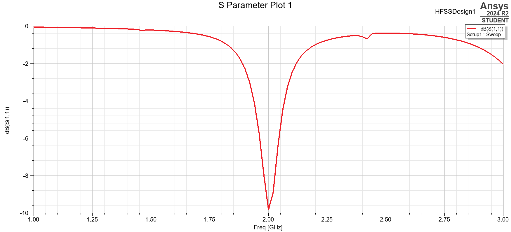
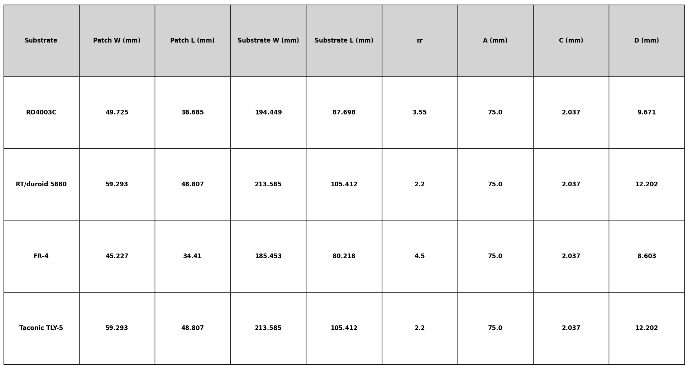
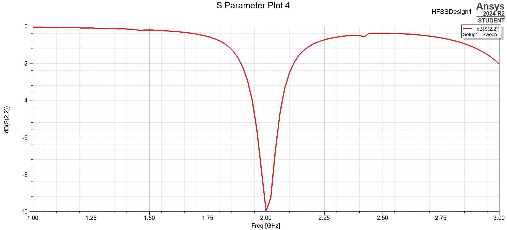
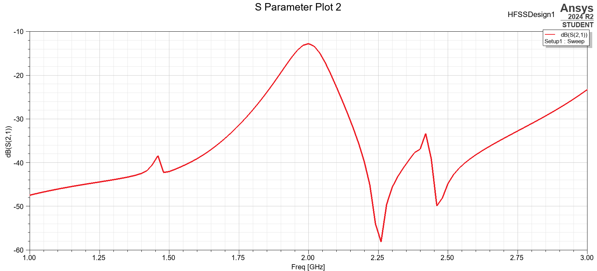
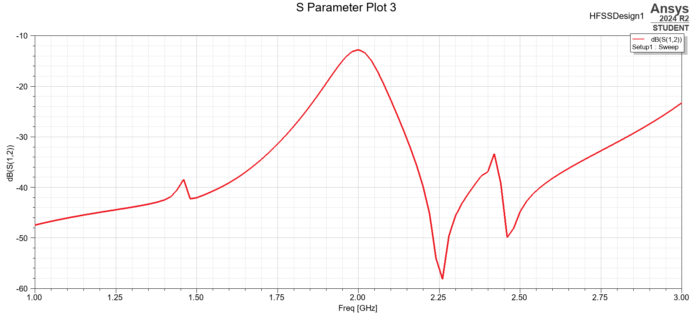

# Miniaturised Low-Power SAR Antenna for UAVs

Microstrip patch antenna design for a miniaturized, low-power Synthetic Aperture Radar (SAR) payload on a small UAV, done as an RVCE "Fundamentals of Avionics" course project (AS345AT, 2024-25).



## Overview

A single L-band (2 GHz) rectangular microstrip patch antenna, sized and analyzed by hand using standard transmission-line-model equations, then simulated in ANSYS HFSS (student license) to check the design against the theory. The goal was a patch small and light enough for a UAV payload while still resonating cleanly at 2 GHz with usable bandwidth and gain for SAR imaging.

**Why L-band, why a patch:** L-band (roughly 1-2 GHz) penetrates vegetation and light precipitation better than higher SAR bands and is well suited to ocean-surface roughness and general all-weather imaging, which made it a reasonable target for a small demonstrator. A microstrip patch was chosen over other antenna types because it's low-profile (doesn't add aerodynamic drag), can be fabricated on standard PCB processes, and is light enough not to matter on a UAV payload budget. The tradeoff is bandwidth and efficiency: a patch is a resonant, narrowband structure with surface-wave and dielectric losses that a horn or reflector wouldn't have, which is why the substrate choice below matters as much as the patch dimensions.

## How it works

### Design method

Standard transmission-line model for a rectangular patch. This model treats the patch as two radiating slots (at the non-fed edges) connected by a low-impedance transmission line, and is accurate to within a few percent for substrates with h << λ, which holds here.

**Patch width** (sets the radiation resistance and, indirectly, bandwidth):

$$W = \frac{v_0}{2f_r}\sqrt{\frac{2}{\varepsilon_r + 1}}$$

**Effective dielectric constant** (accounts for fringing fields partly in air, partly in substrate, since the patch isn't fully embedded in the dielectric):

$$\varepsilon_{reff} = \frac{\varepsilon_r + 1}{2} + \frac{\varepsilon_r - 1}{2}\left[1 + 12\frac{h}{W}\right]^{-1/2}$$

**Length extension** (fringing fields at the radiating edges make the patch look electrically longer than its physical length, so the physical length has to be under-sized to compensate):

$$\Delta L = 0.412h\,\frac{(\varepsilon_{reff}+0.3)\left(\frac{W}{h}+0.264\right)}{(\varepsilon_{reff}-0.258)\left(\frac{W}{h}+0.8\right)}$$

**Physical length** (this is the dimension that actually sets the resonant frequency):

$$L = \frac{v_0}{2f_r\sqrt{\varepsilon_{reff}}} - 2\Delta L$$

**Feed placement:** the edge of a patch is a high-impedance point (hundreds of ohms) and the center is near zero, so a direct 50 Ω edge feed doesn't match. The design uses an inset feed, a notch cut into the patch from the radiating edge, because the impedance varies smoothly along that notch and a feedpoint can be found where it's close to 50 Ω without needing an external quarter-wave transformer or a coax probe through the substrate. The inset depth used here is 3.5 mm with a 1.65 mm, 50 Ω microstrip feed line.

### Substrate selection

Compared ceramic, polymer and PTFE-composite substrate families and picked **RT/Duroid 6006** ($\varepsilon_r = 6.0$, $\tan\delta = 0.0019$ at 2 GHz) for its balance of dielectric constant, low loss, and standard PCB-compatible processing. A higher $\varepsilon_r$ shrinks the patch (smaller W and L for the same resonant frequency), which is why it was preferred over a low-$\varepsilon_r$ substrate like RT/Duroid 5880 or FR-4 for a size-constrained UAV payload, at the cost of narrower bandwidth and lower radiation efficiency (more of the field stays trapped in the denser dielectric instead of radiating).

Substrate thickness (h = 3.2 mm) was chosen from the usual bound that keeps the design thin enough to avoid exciting surface waves (which steal power from the main radiated field and distort the pattern) while still giving enough bandwidth to be usable:

$$\frac{0.003\lambda_0}{\sqrt{\varepsilon_r}} \le h \le \frac{0.05\lambda_0}{\sqrt{\varepsilon_r}}$$

which for this substrate keeps h well under the surface-wave onset thickness (~16.8 mm).

`docs/Figure_1.png` carries the same width/length calculation through for four other candidate substrates (RO4003C, RT/Duroid 5880, FR-4, Taconic TLY-5) side by side so the tradeoff is visible directly rather than asserted:



RT/Duroid 6006 gives the smallest footprint of the set at this εr while staying in a practical thickness range, which is the reasoning behind picking it over the lower-εr alternatives.

### Final dimensions (theoretical)

| Parameter | Value |
|---|---|
| Operating frequency | 2.0 GHz |
| Patch length (L) | 27.0 mm |
| Patch width (W) | 40.09 mm |
| Substrate thickness (h) | 3.2 mm |
| Substrate | RT/Duroid 6006 |
| Effective dielectric constant | 5.29 |
| Theoretical resonant frequency | 1.945 GHz |
| Feed | Inset feed, 3.5 mm inset, 1.65 mm line width (50 Ω match) |

## Building the report

```
cd Report
pdflatex main.tex
```

Needs a standard LaTeX distribution with `amsmath`, `tikz`, `pgfplots`, `booktabs`, `natbib` and `hyperref`. The compiled report and slide deck as submitted are already in `docs/` if you just want to read the write-up without building it.

## Results / validation

The `.aedt` project simulates the design as a two-port (two-element) layout, so all four S-parameters are reported by HFSS.

**S11 (input return loss)** — resonance lands right at 2.0 GHz as designed, with a return loss of about **-9.8 dB** at the dip. That confirms the resonant frequency prediction from the transmission-line model, but is a shallower match than a typical antenna design target (see discrepancy note below).



**S22** mirrors S11 closely, as expected for a symmetric two-element layout, both ports see essentially the same patch geometry.




**S21 / S12 (isolation between the two ports)** stays well below -30 dB across the 2 GHz region (down to about -58 dB near 2.26 GHz), so the two elements are well isolated from each other and don't meaningfully couple energy between ports.

### Where the report and the simulation disagree

Worth being upfront about, since the write-up in `Report/main.tex` doesn't fully match the `.aedt` results:

- The report's "expected results" section states a target of **< -20 dB return loss**. The actual HFSS sweep bottoms out at **~-9.8 dB** at 2.0 GHz, a real resonance at the right frequency, but not the depth of match the report implies. A -9.8 dB return loss means roughly 10% of incident power is still reflected at resonance, usable but not a well-matched antenna by typical design standards.
- The written derivation for the physical patch length shows visible "correct to match design" steps (the effective length comes out to 32.6 mm from the formula, gets knocked down to 29.8 mm by the fringing correction, and then the report rounds it to 27.0 mm to align with a stated final value) rather than a single clean pass through the equations. The final dimensions table is consistent internally, it's just worth knowing the length wasn't derived in one straight shot.
- The theory in `main.tex` is written for a single patch element, but the `.aedt` project and the S-parameter results are from a two-port structure. The S11/S22 plots above are what the model actually produced.

None of this invalidates the design (2 GHz resonance is real and confirmed in simulation), but the gain, bandwidth and -20 dB target figures quoted in the abstract and results table are the hand-calculated targets, not confirmed by the S-parameter sweep in this repo. If you're using this repo as a reference, treat the equations and substrate-selection reasoning as the trustworthy part, and the S-parameter plots as the actual simulated outcome, the abstract's summary numbers are aspirational.

## Repo layout

```
Miniaturised-Low-Power-SAR-Antenna-for-UAVs/
├── SAR MINI.aedt          ANSYS HFSS (student) project, the S-parameter simulation
├── Report/
│   ├── main.tex             full project report source (derivation, literature review,
│   │                        thermal and power-budget analysis, references)
│   ├── Avioncs_EL.pdf       an earlier/related compiled report
│   └── images/              figures referenced by main.tex (S-parameters, RVCE logo)
└── docs/
    ├── Avioncs Report.pdf         compiled report as submitted
    ├── Avionics Presentation.pdf  slide deck as submitted
    └── Figure_1.png               substrate comparison chart
```

## Limitations

- No physical prototype was built or measured, this is a theoretical/simulated design only (HFSS student license, hand calculations).
- No radiation pattern, gain, or bandwidth plots are included in this repo, only the four S-parameters shown above. The gain (6-8 dBi) and bandwidth (~3.3%) figures in the report are analytical estimates, not simulation output.
- The report's single-element theory and the two-port simulation aren't the same structure (see above), so treat the equations as the design methodology and the S-parameter plots as what was actually simulated.
- The -9.8 dB return loss at resonance means the match isn't as good as the report's stated target, a follow-up would need to sweep the inset feed depth/width to pull that closer to -20 dB before this is worth prototyping.

## References

- Balanis, C. A. (2016). *Antenna Theory: Analysis and Design*, 4th Ed. Wiley.
- Garg, R., Bhartia, P., Bahl, I., Ittipiboon, A. (2001). *Microstrip Antenna Design Handbook*. Artech House.
- James, J. R., Hall, P. S. (1989). *Handbook of Microstrip Antennas*. Peter Peregrinus.
- Curlander, J. C., McDonough, R. N. (1991). *Synthetic Aperture Radar: Systems and Signal Processing*. Wiley.
- Cumming, I. G., Wong, F. H. (2005). *Digital Processing of Synthetic Aperture Radar Data*. Artech House.

Full report (`Report/main.tex`) has the complete reference list.
